# Arch Linux V2.0

<p align="left">
  
  
  
  
  
</p>

<p align="left">
<a href="https://www.buymeacoffee.com/adi1090x"></a>
<a href="https://ko-fi.com/adi1090x"></a>
</p>

Second version of my custom ISO based on `Arch Linux`, made with **Archiso**... (for newbies and DIY enthusiasts)

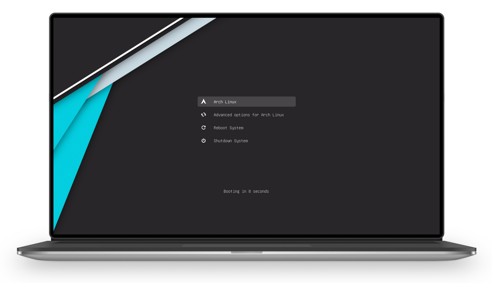 <br />

## Features

+ Offline Installer - [Installation Guide Here](https://github.com/adi1090x/archlinux/blob/master/images/Installer/README.md)
+ Enabled `Encryption` Settings By Default
+ Grub - With `Vimix theme` - Configured
+ Plymouth - `Miniloop Theme` - Configured
+ Xorg Server / GUI - `Intel Video Drivers`
+ Lightdm Display Manager - With `lightdm-gtk-greeter`
+ Openbox Window Manager - Fully Configured
+ Global `Dark` & `Light` Modes
+ Custom `Gtk` And `Icon` Themes
+ Network Manager - With `networkmanager_dmenu`
+ File Manager - `Thunar` with full Functionality (Partition Mounting, Network Access, Thumbnails Etc)
+ Compositor - `picom`
+ Notifications - `dunst`
+ Status - `polybar` 
+ Menus, Applets, Dialogs - `Rofi`
+ AUR helper - `yay`
+ Shell (zsh with `omz`), Vim, Ranger, etc - Configured
+ And a lot...

## How To Get ISO

**1. Download -** You can either download already generated ISO file ***[UPLOAD SOON]***, or...
<p align="center">
  <a href="#" target="_blank"></a>
</p>
  
**2. Build ISO -** If you're already using archlinux & want to build the iso, maybe with modified config then...

***Check list***
- [ ] At least 10GB of free space
- [ ] Arch Linux 64-bit only
- [ ] Clear pacman cache; ```sudo pacman -Scc```
- [ ] Configure everything as *root*
- [ ] Disable auto updates

+ Open the terminal & clone this `branch` of repository 
```bash
git clone --single-branch --branch version-2.0 --depth=1 https://github.com/adi1090x/archlinux.git archlinux
```

+ After cloning, run *'setup.sh'*, it'll install the dependencies, AUR packages, Fix Permissions, Etc. Be Patient!
```bash
cd archlinux
chmod +x setup.sh
./setup.sh
```

+ Now, Change to *'iso'* directory & get ***ROOT*** & Run *'build.sh'*
```bash
cd iso
sudo su
./build.sh -v
```

+ If everything goes well, you'll have the ISO in *'iso/out'* directory. <br />

> If you want to Rebuild the ISO, remove **work** & **out** dirs inside **iso** directory first. Then run `./build.sh -v` as *root*. You don't need to run **setup.sh** again, it's a one time process only. 

## Boot The ISO

**1. Using GRUB -** If you're already using a linux distro, with grub, then you can add following entry in your `grub.cfg` file, Replace **X** with your partition number, and `path_to_your_iso` with ISO path, which can be *(/home/USERNAME/archlinux/iso/out/archlinux-xxxx.xx.xx-x86_64.iso)* <br />
```
menuentry 'Arch Linux Live' --class arch --class gnu-linux --class linux {
    set root='(hd0,X)'
    set isofile="path_to_your_iso"
    set dri="free"
    search --no-floppy -f --set=root $isofile
    probe -u $root --set=abc
    set pqr="/dev/disk/by-uuid/$abc"
    loopback loop $isofile
    linux  (loop)/arch/boot/x86_64/vmlinuz img_dev=$pqr img_loop=$isofile driver=$dri quiet loglevel=3 systemd.show_status=false udev.log-priority=3 vt.global_cursor_default=0 splash cow_spacesize=1G
    initrd  (loop)/arch/boot/intel_ucode.img (loop)/arch/boot/x86_64/archiso.img
}

```
<br />

**2. Using dd -** Alternatively, you can use ***dd*** command to make a bootable USB_Drive/SDcard, Just open the terminal and... <br />
```bash
sudo su
dd bs=4M if=path_to_iso of=/dev/sdX status=progress oflag=sync
```
<br />

**3. Using Etcher -** If you use *Windows*, or maybe linux but afraid of ***dd***, then you can use [Etcher](https://www.balena.io/etcher/) to make a bootable USB/SDcard. More Options [Here](https://wiki.archlinux.org/index.php/USB_flash_installation_media)
<br />

## What's New

+ New Look and Style

Desktop|Modes
:--:|:--:
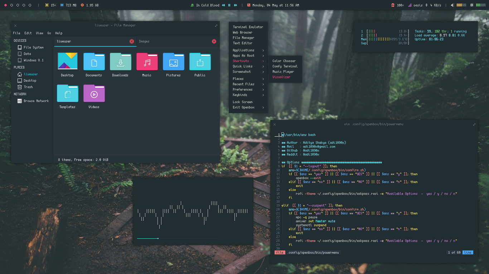|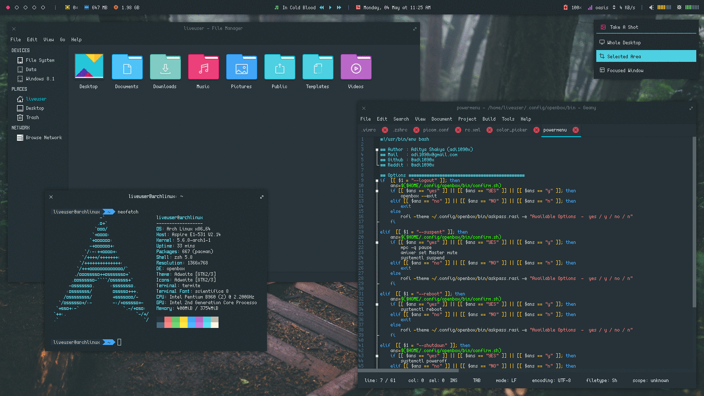

+ Rofi based custom applets

|Network|MPD|System|Internet|Screenshot|
|--|--|--|--|--|
|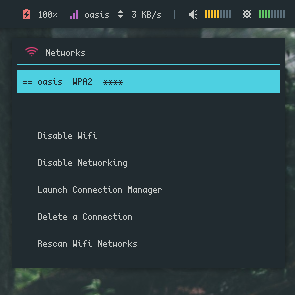|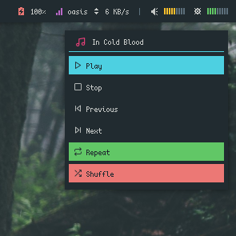|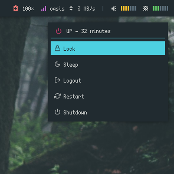|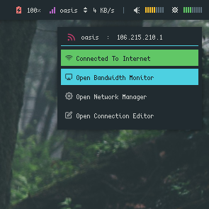||

+ Rofi based custom dialogs

|Password|Message|Confirmation|
|--|--|--|
||||

+ Improved Notifications, With Icons

|Volume Up|Volume Down|Backlight Up|Backlight Down|Colors|Album Art|
|--|--|--|--|--|--|
||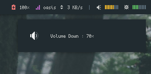||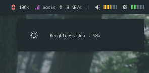|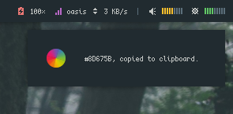|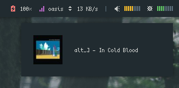|

+ New Themes And Styles

Grub|Plymouth
:--:|:--:
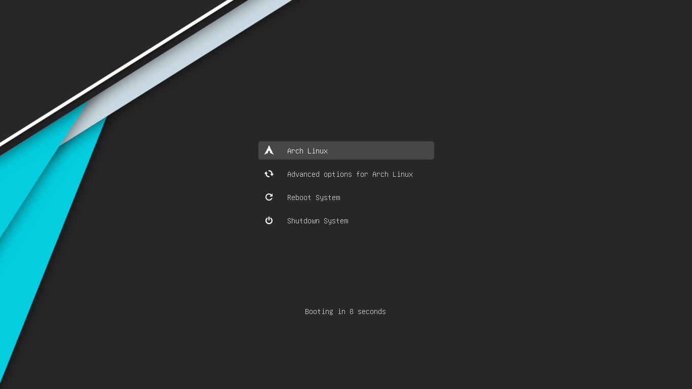|

Lightdm|i3lock
:--:|:--:
|

## Installation

 This ISO can be installed, Offline, thanks to [ABIF](https://github.com/adi1090x/archlinux/tree/version-2.0/iso/airootfs/abif-master). I've tested & installed it on a **USB Drive, SDcard, HDD & Virtualbox**, works as expected. Just Don't forget to install *virtualbox guest additions* after installing it on virtualbox.

The installer is very simple and easy to use, but what if you're still a *windows* guy or a *softcore linux user* (Coz arch is for **Hardcore linux users**, Did you get it? NEVERMIND :P). So i've created a step by step guide on how to install it - [Here, How To Install It.](https://github.com/adi1090x/archlinux/blob/master/images/Installer/README.md)
<br />

## Tour
<details><summary>Desktop Session</summary>

Desktop|Openbox Menu
:--:|:--:
|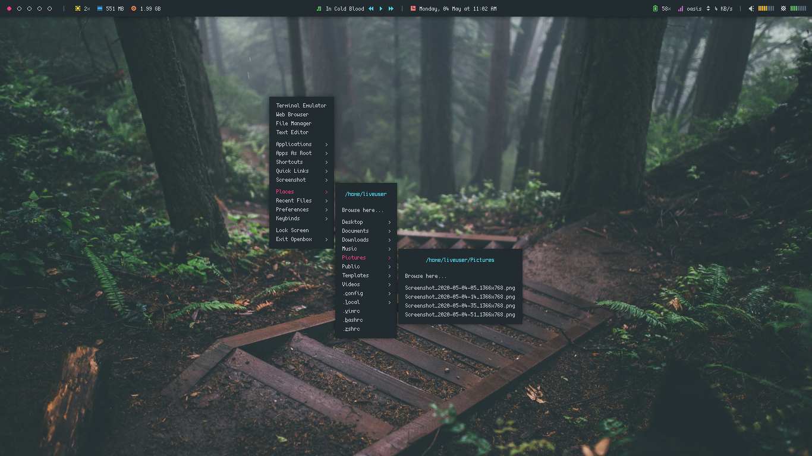

Launcher|Termite
:--:|:--:
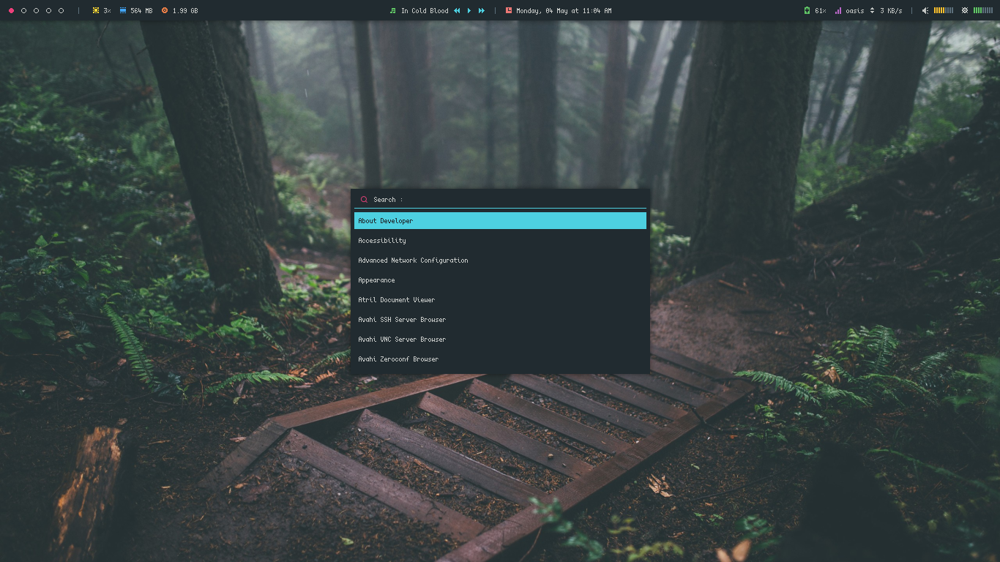|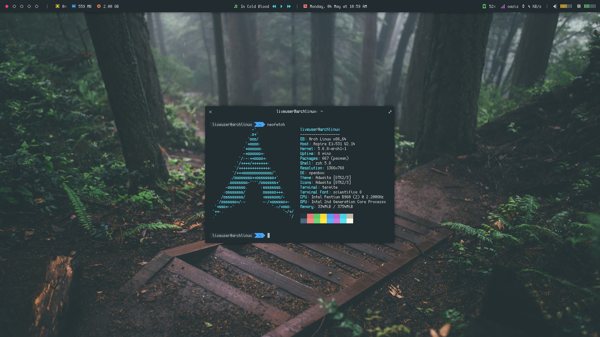

Thunar|Geany
:--:|:--:
|

Midori|Apps
:--:|:--:
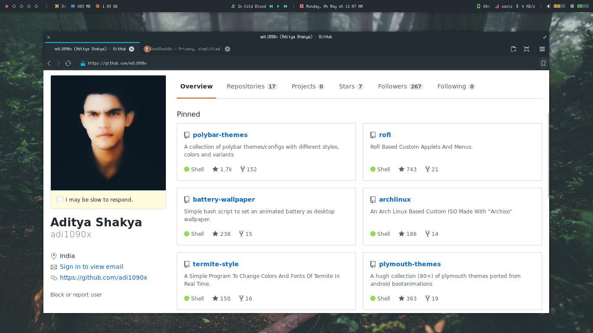|

Busy Desktop |Messy Desktop
:--:|:--:
|
</details>

<details><summary>Modes</summary>

|Default Dark|Default Light|Terminal|Terminal|
|--|--|--|--|
||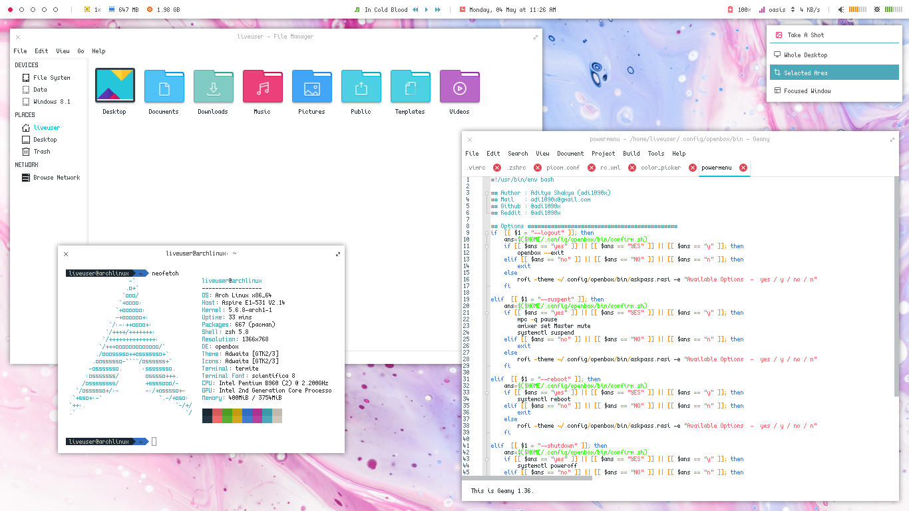|||

|Launcher Dark|Launcher Light|Menu Dark|Menu Light|
|--|--|--|--|
||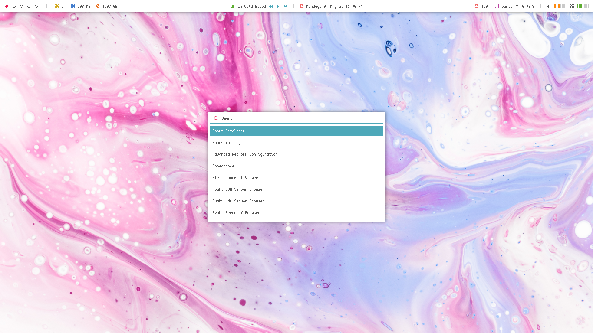||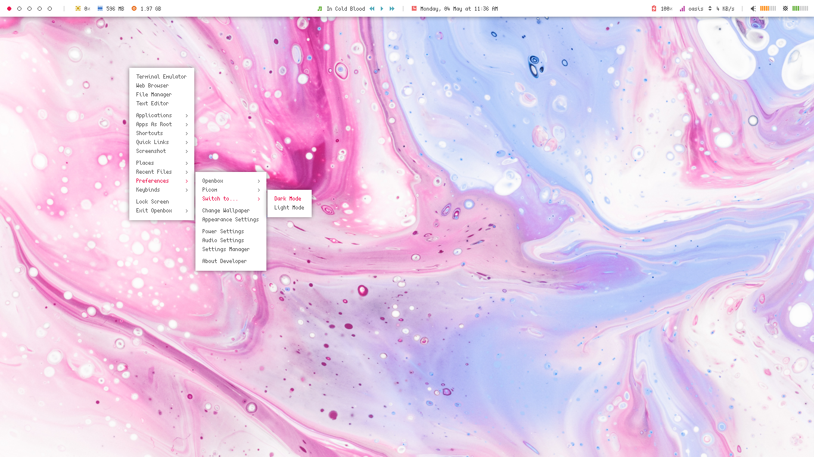|

|Applets Dark|Applets Light|Dunst Dark|Dunst Light|
|--|--|--|--|
|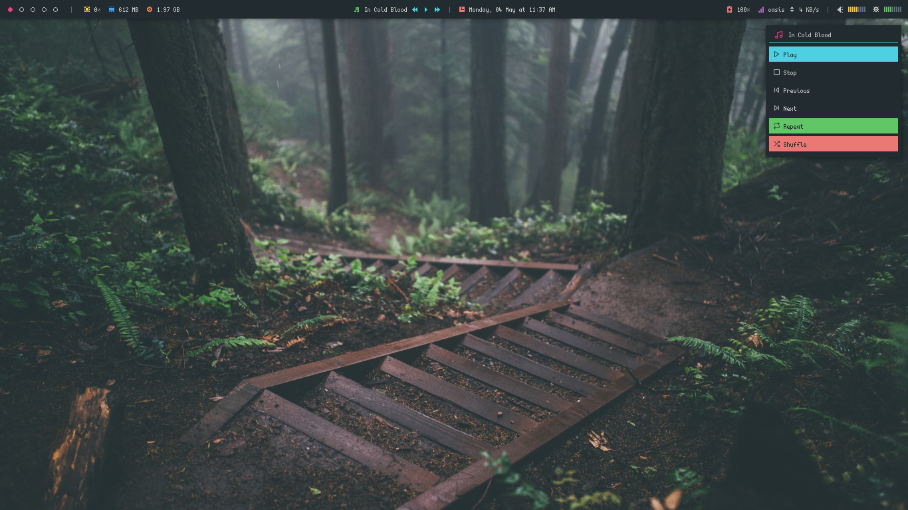|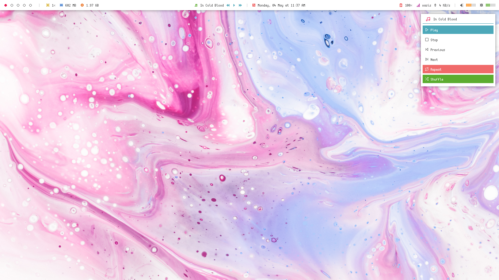|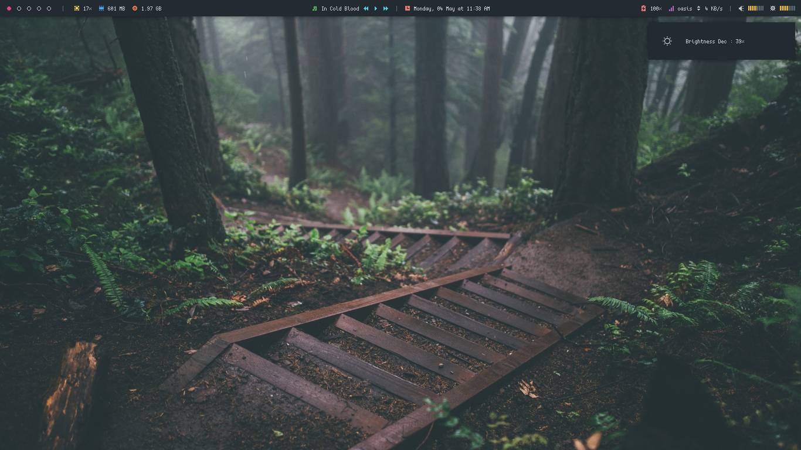|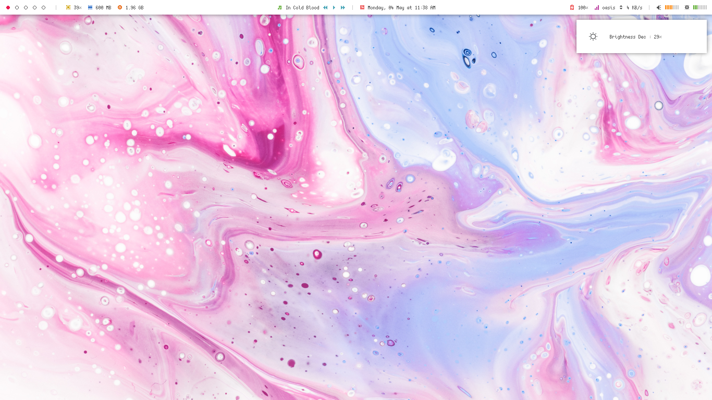|

</details>

<details><summary>Tiling</summary>

Tiling 1|Tiling 2
:--:|:--:
|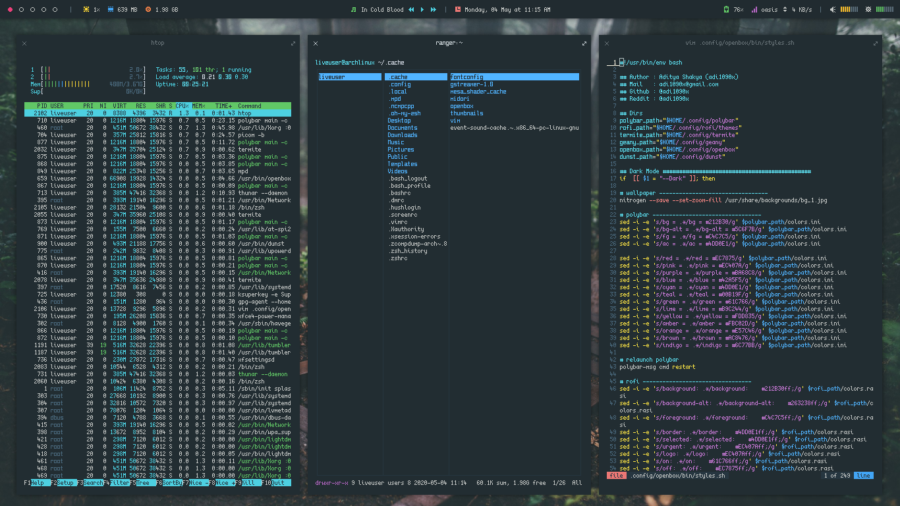

Tiling 3|Tiling 4
:--:|:--:
|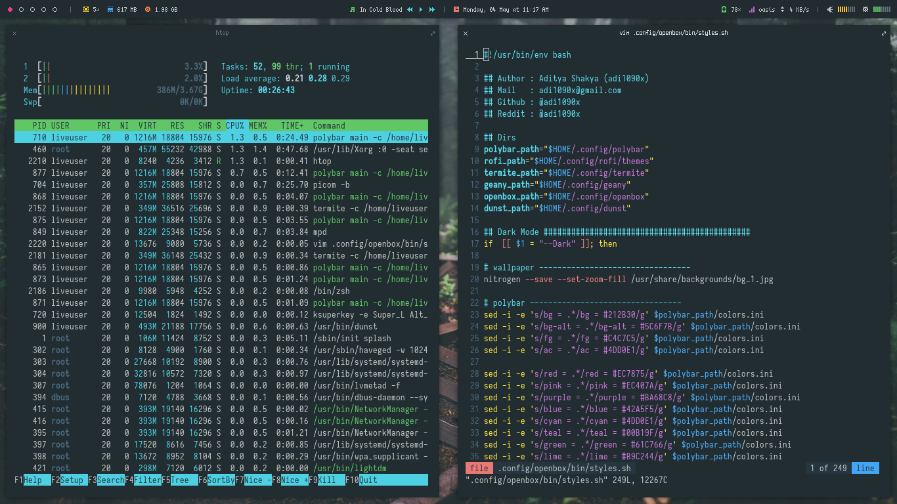

</details>

## Keybinding

<details><summary>Workspaces</summary>

|Key|Action||Key|Action|
:--:|:--:|:--:|:--:|:--:
|||||
|**W+1**|Go To Desktop 1|&nbsp;   &nbsp;   &nbsp;   &nbsp;   &nbsp;|**W+2**|Go To Desktop 2|
|**W+3**|Go To Desktop 3||**W+4**|Go To Desktop 4|
|**W+S+1**|Send To Desktop 1||**W+S+2**|Send To Desktop 2|
|**W+S+3**|Send To Desktop 3||**W+S+4**|Send To Desktop 4|
|**W+S+Left**|Send To Desktop Left||**W+S+Right**|Send To Desktop Right|

</details>

<details><summary>Windows</summary>

|Key|Action|&nbsp;   &nbsp;   &nbsp;   &nbsp;   &nbsp;|Key|Action|
:--:|:--:|:--:|:--:|:--:
|||||
|**W+Tab**|Next Window (All Desktop)||**A+Tab**|Next Window (Current Desktop)|
|**W+Left**|Move To Edge West||**W+Right**|Move To Edge Eest|
|**W+Up**|Maximize Full||**W+Down**|Unmaximize 60x80|
|**W+h**|Top Left||**W+j**|Bottom Left|
|**W+k**|Top Right||**W+l**|Bottom Right|
|**W+KP_1**|Bottom Left 50x50||**W+KP_7**|Top Left 50x50|
|**W+KP_3**|Bottom Right 50x50||**W+KP_9**|Top Right 50x50|
|**W+KP_2**|Bottom 100x50||**W+KP_8**|Top 100x50|
|**W+KP_4**|Left 50x100||**W+KP_6**|Right 50x100|
|**W+A+Up**|Move Up||**W+A+Down**|Move Down|
|**W+A+Left**|Move Left||**W+A+Right**|Move Right|
|**C+A+Up**|Resize to Up||**C+A+Down**|Resize to Down|
|**C+A+Left**|Resize to Left||**C+A+Right**|Resize to Right|
|**A+r**|Toggle Resize||**A+m**|Toggle Move|
|**A+F4**|Close Window||**A+F5**|Minimize Window|
|**A+F6**|Maximize Window||**A+F7**|Toggle Decorations|

</details>

<details><summary>System</summary>

|Key|Action||Key|Action|
:--:|:--:|:--:|:--:|:--:
|||||
|**XF86AudioRaiseVolume**|Increase Volume||**XF86AudioLowerVolume**|Decrease Volume|
|**XF86MonBrightnessUp**|Increase Brightness||**XF86MonBrightnessDown**|Decrease Brightness|
|**Print**|Take a screenshot||**A+Print**|Take a screenshot in 5 Sec|
|**C-S-Escape**|Exit WM||**C-S-BackSpace**|Restart Openbox|
|**C-S-R**|Reconfigure Openbox||**W-Escape**|Kill App|
|**W+d**|Show Desktop||**W+space**|Root Menu|

</details>

<details><summary>Applications</summary>

|Key|Action||Key|Action|
:--:|:--:|:--:|:--:|:--:
|||||
|**W+e**|Text Editor `geany`||**W+f**|File Manager `thunar`|
|**W+t**|Terminal Emulator `termite`||**W+w**|Web Browser `midori`|
|**W+n**|Network Menu||**W+m**|MPD Menu|
|**W+x**|Power Menu||**W+r**|App Runner|
|**W+s**|Screenshot Menu||**W+i**|Internet Menu|
|**W+c**|Colorpicker||**W**|App Launcher|
|**C+A+l**|Lockscreen `i3lcok`||**C+A+v**|CLI editor `vim`|
|**C+A+r**|CLI File Manager `ranger`||**C+A+h**|System Monitor `htop`|

</details>

### Support This Project
<p align="left">
<a href="https://www.paypal.me/adi1090x" target="_blank"></a>
<a href="https://www.buymeacoffee.com/adi1090x" target="_blank"></a>  
<a href="https://ko-fi.com/adi1090x" target="_blank"></a>  
</p>

## Few Words

+ I'm really bad at *Naming Things*, So Again... i've kept it simple - just ***Archlinux***. 
+ Default `username` and `password` is ***liveuser*** (Live ISO Only).
+ After installing this ISO, run `sudo pacman -Syy` to fix pacman. it'll just download packages database.
+ In this ISO, I've enabled **encryption settings (luks/dm-crypt)** by default. If you're installing it without encryption, there will be no issue, but these settings are useless for you in this case. So after normal installation, comment out `GRUB_ENABLE_CRYPTODISK=y` in */etc/default/grub* and remove `plymouth-encrypt` hook in */etc/mkinitcpio.conf* and rebuilt initrd.
+ **Important -** I've tested it on two laptops, with intel pantium & i3 CPUs. Obviously ISO have intel-video drivers, if you have `nvidia` or something, edit ***packages.x86_64*** and replace the drivers section with your GPU drivers packages, or WM/DE might freeze on startup.
+ You may have to modify some config files according to your system, (i mean that's the goal, right). ***Ex-*** `customiso/airootfs/etc/skel/.config/polybar/modules.ini` for *Battery* & *Network* Modules.
+ By default, touchpad is disabled. To enable it... Open Settings manager & goto `Mouse & Touchpad>Touchpad>Tap to click`.
+ While installing it on the USB, installer seems like it freezed when grub was installing. Problem it - `os-prober` was taking a long time to detect other OS installed on system. it took 10-12 mins to complete. on other media (SDcard & HDD), there was no such issue. Maybe it's a bug related to os-prober, thought i should mention it here. if you face it, pls wait!
+ It's a 64-bit only ISO/OS.
+ ***Updates:*** Well, the best things is, you'll always get the latest Linux kernel, Archlinux System & Packages, if you `build it`. if you can't, Then Install this ISO, run `sudo pacman -Sy archlinux-keyring && sudo pacman -Syu` & DONE, you'll have the latest Arch Linux system.
+ Share this **repo** with your friends/classmates/colleagues who're new to linux/Archlinux.
